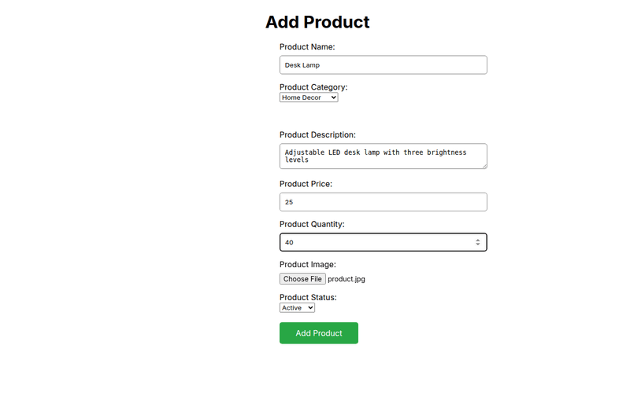
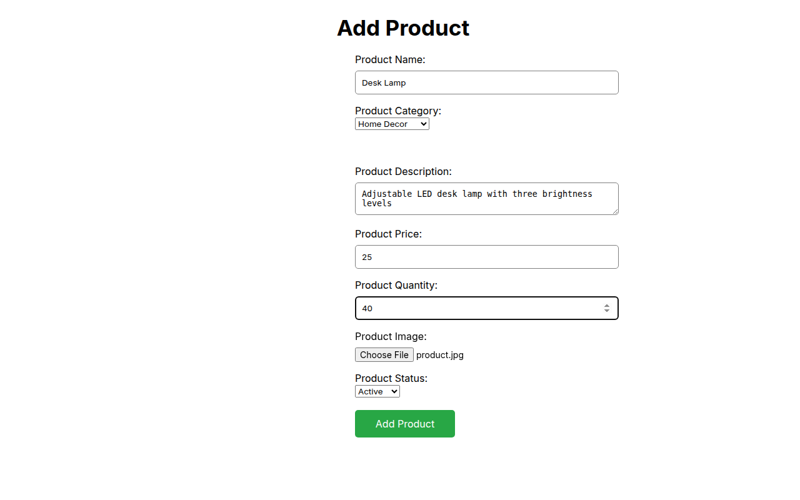
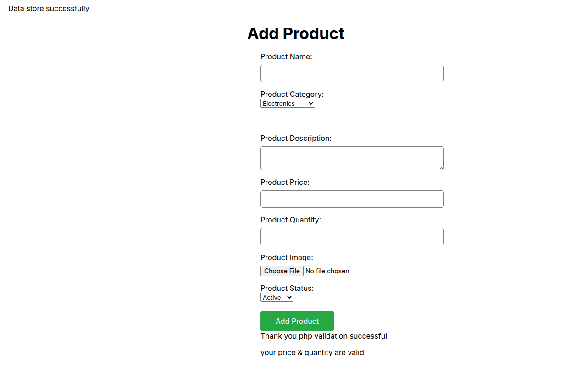
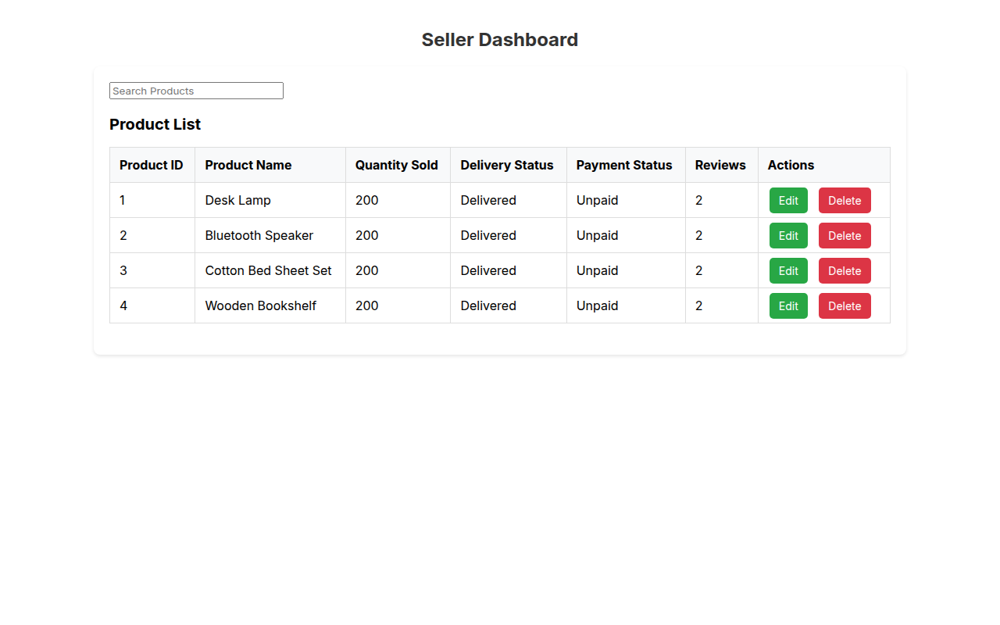
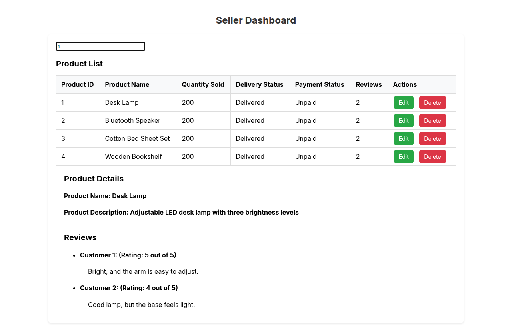
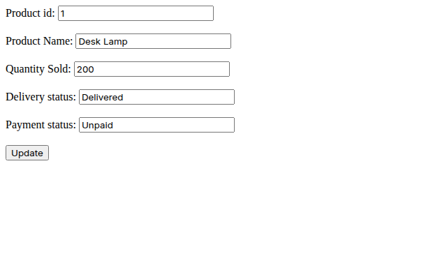

# Buyer–Seller CRUD Operation System

A PHP and MySQL product manager for sellers: add, list, search, edit and delete products in the browser.

<p align="center">
  
</p>

<table>
  <tr>
    <td align="center" width="20%"><a href="screenshots/add-product.png"></a><br><sub><b>Add product</b></sub></td>
    <td align="center" width="20%"><a href="screenshots/add-product-saved.png"></a><br><sub><b>Saved</b> · server-side checks</sub></td>
    <td align="center" width="20%"><a href="screenshots/dashboard.png"></a><br><sub><b>Dashboard</b></sub></td>
    <td align="center" width="20%"><a href="screenshots/search.png"></a><br><sub><b>Search</b> · details and reviews</sub></td>
    <td align="center" width="20%"><a href="screenshots/edit-product.png"></a><br><sub><b>Edit</b></sub></td>
  </tr>
</table>

This is an academic project that covers the full create–read–update–delete cycle with plain PHP (mysqli), MySQL and a little JavaScript. It has no framework or build step, so it's a compact, readable example of how a server-rendered CRUD app fits together. The screenshots show demo data.

## Quick Start

You need PHP 7.4 or newer with the `mysqli` extension, and MySQL or MariaDB running locally with user `root` and an empty password. That's XAMPP's default, and it's what `model/mydb.php` expects.

1. Clone the repository:

   ```bash
   git clone https://github.com/SHAYAN-ABRAR/Buyer-Seller-CURD-Operation-System.git
   cd Buyer-Seller-CURD-Operation-System
   ```

2. Create the database. Paste this into phpMyAdmin's **SQL** tab, or save it as `setup.sql` and run `mysql -u root < setup.sql`:

   ```sql
   -- model/mydb.php inserts '' into pid, which strict SQL mode rejects
   SET GLOBAL sql_mode = 'NO_ENGINE_SUBSTITUTION';

   CREATE DATABASE IF NOT EXISTS product;
   USE product;

   CREATE TABLE product_reg (
     pid INT AUTO_INCREMENT PRIMARY KEY,
     pname VARCHAR(255) NOT NULL,
     pcategory VARCHAR(100),
     pdescription TEXT,
     price DECIMAL(10,2),
     pquantity INT,
     pimage VARCHAR(255),
     pstatus VARCHAR(20),
     quantity_sold INT,
     delivery_status VARCHAR(50),
     reviews INT,
     payment_status VARCHAR(50)
   );

   CREATE TABLE customer (
     cid INT AUTO_INCREMENT PRIMARY KEY,
     pid INT,
     review TEXT,
     rating INT
   );
   ```

   The repository doesn't include a database dump. These tables match the columns the PHP code reads and writes.

3. Start PHP's built-in server from the project folder:

   ```bash
   php -S localhost:8000
   ```

4. Open <http://localhost:8000/view/home.php> to add products, and <http://localhost:8000/view/seller.php> for the dashboard.

With XAMPP, you can also copy the folder into `htdocs` and open `http://localhost/Buyer-Seller-CURD-Operation-System/view/home.php`.

## Features

- **Add products:** a form for name, category, description, price, quantity, image and status (Active or Inactive).
- **Two rounds of validation:** JavaScript requires every field before submitting. PHP then re-checks the required fields and that price and quantity are positive numbers, and prints the result under the form.
- **Image upload:** the chosen image is saved in `images/` and its path is stored with the product.
- **Seller dashboard:** a table of every product with ID, name, quantity sold, delivery status, payment status, review count, and **Edit** and **Delete** buttons.
- **Live search by product ID:** typing an ID calls `control/searchcontrol.php` with `XMLHttpRequest` and shows the product's name, description and customer reviews (rated out of 5) without reloading the page.
- **Edit and delete:** an edit form for the name, quantity sold and delivery status, and deletion after a confirmation dialog.
- **MVC-style layout:** `model/` holds the database class, `control/` handles requests and `view/` renders the pages.

## Usage Example: Customer Reviews

Search results read reviews from the `customer` table, and the app doesn't have a form for adding them. To try the feature, add a review in phpMyAdmin or the MySQL client:

```sql
INSERT INTO product.customer (pid, review, rating)
VALUES (1, 'Bright, and the arm is easy to adjust.', 5);
```

Then type `1` into the search box on the dashboard.

## Configuration

The database connection is set in the constructor in `model/mydb.php`. Change these values if your MySQL user, password or database name are different:

```php
$this->DBHostName = "localhost";
$this->DBUserName = "root";
$this->DBPassword = "";
$this->DBName = "product";
```

## Known Limitations

- **Strict SQL mode:** Add Product only works with MySQL's strict mode off, because the insert sends `''` for `pid`. With strict mode on, the insert is rejected but the page still says "Data store successfully". The setup SQL turns strict mode off, but the setting resets when MySQL restarts.
- **Placeholder sales values:** every new product is saved with quantity sold 200, "Delivered", "Unpaid" and 2 reviews, which are hard-coded in `insertOrder()`. The dashboard's **Reviews** column shows that stored number, not a count of rows in `customer`.
- **Case-sensitive table names:** `control/update.php` refers to the table as `Product_reg`. Saving an edit therefore only works where MySQL table names are case-insensitive (the default on Windows/XAMPP and macOS). On Linux it fails with `Table 'product.Product_reg' doesn't exist`.
- **Payment status field:** the edit form's **Payment status** box is saved into the product status column (`pstatus`), not `payment_status`.
- **Delete page:** deleting shows a plain "Successfully Deleted" page. Use the browser's Back button to return to the dashboard.
- **Security:** queries are built by joining strings, and there's no login. Keep the app on localhost, or switch to prepared statements and add authentication first.

## Tech Stack

- PHP (object-oriented `mysqli`), tested with PHP 8.4
- MySQL / MariaDB, tested with MariaDB 10.11
- HTML and CSS (`css/style.css`)
- Vanilla JavaScript (form validation and `XMLHttpRequest` search)

## Project Structure

```text
Buyer-Seller-CURD-Operation-System/
├── model/
│   └── mydb.php            # Database connection and all queries
├── control/
│   ├── process.php         # Validates the Add Product form, saves the image, inserts the row
│   ├── showproduct.php     # Renders the product table
│   ├── update.php          # Loads a product and saves edits
│   ├── delete.php          # Deletes a product by ID
│   └── searchcontrol.php   # Search endpoint: product details and reviews
├── view/
│   ├── home.php            # Add Product page
│   ├── seller.php          # Seller dashboard (list, search, edit, delete)
│   └── updateview.php      # Edit Product page
├── js/script.js            # Client-side validation and search request
├── css/style.css
├── images/                 # Uploaded product images and earlier screenshots
└── screenshots/            # README images
```

## Contributing

Bug reports and suggestions are welcome. Please [open an issue](https://github.com/SHAYAN-ABRAR/Buyer-Seller-CURD-Operation-System/issues) that describes what you found. Please read the license note below before reusing any code.

## License

This repository doesn't have a license yet, so it doesn't grant anyone permission to reuse or redistribute its code or images. Please ask before reusing any part of it.

---

Built by **Shayan Abrar** · [GitHub](https://github.com/SHAYAN-ABRAR) · [LinkedIn](https://www.linkedin.com/in/shayan-abrar/)
